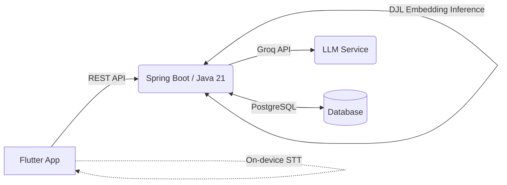

<h1 align="center">
  <br>
  Rehearsal
  <br>
</h1>

<h4 align="center">An AI-Assisted Mock Interview & Speech Analytics Platform</h4>

<p align="center">
  <a href="#about-the-project">About</a> •
  <a href="#features">Features</a> •
  <a href="#architecture">Architecture</a> •
  <a href="#tech-stack">Tech Stack</a> •
  <a href="#getting-started">Getting Started</a>
</p>

---

## 🎯 About the Project

**Rehearsal** is a premium, privacy-focused mock interview platform designed to give candidates structured, role-specific practice. Instead of relying on generic question banks or unethical "confidence scoring," Rehearsal uses NLP embeddings to match your resume with a specific job description. It generates tailored interview questions and computes *objective* speech metrics from on-device transcriptions, helping you refine your pacing, eliminate filler words, and structure your responses with confidence.

**Core Philosophy:** 
- **Role-Specific:** Practice against actual Job Descriptions, not generic banks.
- **Objective Feedback:** No subjective AI "hireability" or sentiment scores. Just actionable data.
- **Privacy-First:** Audio processing uses on-device STT; videos remain your property and can be deleted anytime.
- **Accessible:** Built entirely on free-tier architecture for democratized interview preparation.

---

## ✨ Features

- **📄 Semantic Resume-JD Matching**: Upload your resume and paste a Job Description. Rehearsal computes a real semantic match score using `all-MiniLM-L6-v2` embeddings, providing transparent keyword overlap insights.
- **🤖 LLM-Generated Questions**: Receive a custom set of technical, behavioral, and situational questions generated by an LLM grounded specifically in your resume and the target JD.
- **🎥 In-App Recording Flow**: Record video answers natively in the app with built-in timers and background chunked uploads to ensure reliability over flaky connections.
- **📊 Objective Speech Analytics**: Get transcribed reports and actionable metrics, including:
  - Words Per Minute (WPM)
  - Filler Word Rate
  - Pause Duration & Frequency
  - Speaking vs. Silence Ratio
- **📈 Practice Reports**: Track your improvement over time with detailed session histories and playback capabilities.

---

## 📐 Architecture

Rehearsal employs a clean, scalable client-server architecture with an emphasis on edge-processing where appropriate.



### Key Architectural Decisions
- **On-Device STT:** Keeps raw audio client-side initially, reducing backend bottlenecks and avoiding paid cloud STT services.
- **Native JVM Inference:** Deep Java Library (DJL) runs the MiniLM embedding model natively on the JVM inside the Grails/Spring service layer—eliminating the need for a separate Python microservice.
- **Interface-Driven LLM integration:** Question generation is isolated behind interfaces, allowing seamless swapping of LLM providers (e.g., Groq, Gemini) without breaking core logic.

---

## 💻 Tech Stack

| Layer | Technologies |
| :--- | :--- |
| **Mobile Client** | Flutter, Dart (Camera, Record, Speech-to-Text) |
| **Backend API** | Spring Boot, Java 21 |
| **ML Inference** | Deep Java Library (DJL), ONNX Runtime, MiniLM |
| **Generative AI** | Groq API (gpt-oss-120b) |
| **Database** | PostgreSQL |

---

## 🚀 Getting Started

### Prerequisites
- **Flutter SDK** (for the mobile app)
- **Java 21** & **Maven** (for the backend)
- **PostgreSQL** database running locally or via Docker

### Backend Setup
1. Navigate to the backend directory:
   ```bash
   cd backend
   ```
2. Configure your environment variables. Ensure you update `src/main/resources/application.properties` with your actual database credentials and LLM API keys (we recommend using environment variables or a `.env` file instead of committing keys):
   ```properties
   spring.datasource.password=YOUR_DB_PASSWORD_HERE
   groq.api.key=YOUR_GROQ_API_KEY_HERE
   ```
3. Run the application:
   ```bash
   ./mvnw spring-boot:run
   ```

### Mobile Setup
1. Navigate to the mobile directory:
   ```bash
   cd mobile
   ```
2. Fetch dependencies:
   ```bash
   flutter pub get
   ```
3. Run the app on an emulator or connected device:
   ```bash
   flutter run
   ```

---

## 🛡️ Security & Privacy Note
- **API Keys:** Never commit your `groq.api.key` or database passwords to version control. The repository includes a `.gitignore` to prevent accidental leaks of `.env` files and IDE configurations.
- **User Data:** Video and audio are stored securely and can be completely wiped by the user upon request.

---

<p align="center">
  <i>Built with passion by <b>Muhammad Ayan Khan</b>.</i>
</p>
